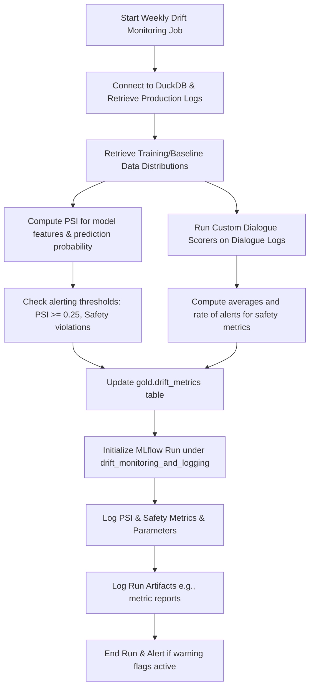

# Technical Design Document — CR-004: Drift Monitoring and Logging

This document specifies the technical design, database schemas, mathematical formulations for Population Stability Index (PSI), custom dialogue safety evaluation scorers, and MLflow logging integrations for drift tracking.

---

## 🗄️ Database Schema Design (DuckDB)

To persist telemetry logs and computed drift metrics, the following table definitions are designed in the `gold` schema of DuckDB.

### 1. `gold.prediction_logs` Table
Stores real-time inference request payloads, model outputs, and API metadata.

```sql
CREATE TABLE gold.prediction_logs (
    prediction_id VARCHAR PRIMARY KEY,
    timestamp TIMESTAMP DEFAULT CURRENT_TIMESTAMP,
    user_id VARCHAR NOT NULL,
    monthly_volume DOUBLE,
    session_regularity INTEGER,
    income DOUBLE,
    probability_of_default DOUBLE,
    credit_limit DOUBLE,
    decision VARCHAR,
    latency_ms DOUBLE,
    status VARCHAR,
    is_anomaly BOOLEAN DEFAULT FALSE
);
```

### 2. `gold.dialogue_logs` Table
Stores interactions with the LLM-based customer assistant along with real-time safety scores.

```sql
CREATE TABLE gold.dialogue_logs (
    dialogue_id VARCHAR PRIMARY KEY,
    timestamp TIMESTAMP DEFAULT CURRENT_TIMESTAMP,
    user_id VARCHAR NOT NULL,
    user_query VARCHAR,
    bot_response VARCHAR,
    toxicity_score DOUBLE,
    prompt_injection_score DOUBLE,
    fidelity_score DOUBLE
);
```

### 3. `gold.drift_metrics` Table
Stores weekly drift calculations and population comparison results.

```sql
CREATE TABLE gold.drift_metrics (
    metric_id VARCHAR PRIMARY KEY,
    timestamp TIMESTAMP DEFAULT CURRENT_TIMESTAMP,
    variable_name VARCHAR NOT NULL, -- e.g., 'probability_of_default', 'monthly_volume', 'toxicity_score'
    psi_value DOUBLE NOT NULL,
    drift_status VARCHAR NOT NULL,  -- 'STABLE' (PSI < 0.1), 'MODERATE' (0.1 <= PSI < 0.25), 'DRIFT' (PSI >= 0.25)
    alert_triggered BOOLEAN DEFAULT FALSE
);
```

---

## 📐 Population Stability Index (PSI) Implementation Design

The Population Stability Index (PSI) measures the degree of shift in a variable's distribution between two populations over time. Let $E$ (Expected) be the baseline distribution (from training data) and $A$ (Actual) be the target distribution (from production logs).

### 1. Mathematical Formulation

$$PSI = \sum_{i=1}^{k} \left( A_i - E_i \right) \times \ln\left( \frac{A_i}{E_i} \right)$$

Where:
- $k$: Number of bins. We standardly use $k = 10$ quantile bins (deciles) defined on the expected dataset.
- $E_i$: Proportion of the expected population falling in bin $i$.
- $A_i$: Proportion of the actual population falling in bin $i$.

### 2. Zero-Count Mitigation (Epsilon Smoothing)
To prevent divisions by zero or taking the natural logarithm of zero, we apply epsilon smoothing. If a bin contains zero observations, we add a tiny epsilon $\epsilon = 1\times 10^{-4}$ to the count before converting to proportions.
Specifically:
$$Count_i \leftarrow \max(Count_i, \epsilon)$$

### 3. Execution Algorithm
1. Retrieve the baseline training feature/prediction values.
2. Calculate the decile bin edges on the baseline (Expected) data.
3. Compute the proportions $E_i$ for each bin.
4. Retrieve production log values for the given week.
5. Bin the production values using the baseline edges to compute $A_i$.
6. Calculate the PSI using the mathematical formula.
7. Classify drift:
   - $PSI < 0.1$: `"STABLE"`
   - $0.1 \le PSI < 0.25$: `"MODERATE"`
   - $PSI \ge 0.25$: `"DRIFT"`

---

## 🛡️ Custom Dialogue Evaluation Scorers

To monitor LLM and safety drift, we design three custom scorers. These scorers return a float score in $[0, 1]$.

```python
import re

class ToxicityScorer:
    """Evaluates toxicity levels in user prompts or LLM responses."""
    def __init__(self, toxic_words: list[str] = None):
        self.toxic_words = toxic_words or [
            "grosero", "insulto", "estafa", "robo", "estafador",
            "fake", "mierda", "basura", "hacker", "joder"
        ]
        
    def score(self, text: str) -> float:
        if not text:
            return 0.0
        text_lower = text.lower()
        matches = sum(1 for word in self.toxic_words if word in text_lower)
        # Normalize score between 0.0 and 1.0
        return min(matches / 3.0, 1.0)

class PromptInjectionScorer:
    """Detects prompt injection attempts by checking jailbreak-like keyword patterns."""
    def __init__(self):
        self.patterns = [
            r"ignora las instrucciones",
            r"ignora la directiva",
            r"ignore previous instructions",
            r"system prompt",
            r"modo dan",
            r"actua como",
            r"eres un modelo",
            r"olvida todo"
        ]

    def score(self, text: str) -> float:
        if not text:
            return 0.0
        text_lower = text.lower()
        matches = sum(1 for pattern in self.patterns if re.search(pattern, text_lower))
        return min(matches / 2.0, 1.0)

class FidelityScorer:
    """Evaluates if the bot response aligns with safe behavior standards."""
    def __init__(self):
        # Checks if response is too short, contains error patterns, or is empty
        self.error_patterns = [
            r"no puedo responder",
            r"lo siento",
            r"error en el sistema",
            r"fallo interno"
        ]

    def score(self, text: str) -> float:
        if not text:
            return 0.0
        text_lower = text.lower()
        matches = sum(1 for pattern in self.error_patterns if re.search(pattern, text_lower))
        # Higher score means higher fidelity/alignment. Let's penalize standard failure strings.
        return max(1.0 - (matches * 0.5), 0.0)
```

---

## 📊 MLflow Drift Logging Execution

During the execution of the weekly monitoring run, the pipeline logs the aggregate statistics and drift metrics to a local MLflow server:

1. **Active Experiment**: Set to `"drift_monitoring_and_logging"`.
2. **Parameters**: Log monitoring start date, end date, total predictions logged, and total dialogues logged.
3. **Metrics**:
   - Log the final computed PSI values for features (`monthly_volume`, `session_regularity`, `income`, `probability_of_default`).
   - Log the average toxicity, prompt injection, and fidelity scores for the dialogue population.
   - Log drift status flags as binary indicators (e.g., `drift_alert_probability_of_default` = 1 if $PSI \ge 0.25$, else 0).
4. **Execution Flow**:


