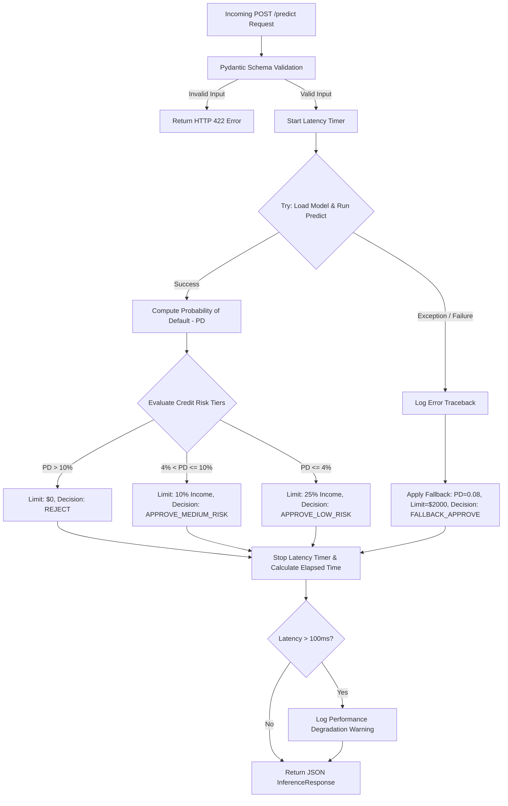

# Technical Design Document — CR-003: FastAPI Inference Service

This document specifies the technical design, Pydantic data schemas, secure model loading/deserialization strategy, dynamic credit limit allocation policy, and latency-performance SLAs for the real-time inference service.

---

## 🛠️ Tech Stack & Web Application Setup

The real-time inference service will be developed as an asynchronous web application using:
- **FastAPI**: Modern, fast (high-performance), web framework for building APIs with Python 3.9+.
- **Uvicorn**: Lightning-fast ASGI server implementation for running the FastAPI application.
- **Pydantic**: Data validation and settings management using Python type annotations.
- **Skops**: Safe serialization and deserialization library to load XGBoost/Scikit-learn models without invoking unsafe pickle executions.

### Application Lifespan & Model Loading
To optimize performance, the XGBoost model must be loaded **once** during service startup and stored in the application state. We utilize FastAPI's lifespan event handler:

```python
import os
from contextlib import asynccontextmanager
from fastapi import FastAPI
import skops.io as sio

@asynccontextmanager
async def lifespan(app: FastAPI):
    # Startup: Load the model securely
    model_path = os.getenv("MODEL_PATH", "models/trained_model.skops")
    try:
        # Load securely by defining trusted types to prevent pickle vulnerabilities
        app.state.model = sio.load(
            model_path,
            trusted=[
                "xgboost.sklearn.XGBClassifier",
                "xgboost.core.Booster",
                "numpy.dtype",
                "numpy.core.multiarray._reconstruct"
            ]
        )
    except Exception as e:
        # Load fallback / log critical error
        app.state.model = None
    yield
    # Shutdown: Clean up resources if necessary
    app.state.model = None

app = FastAPI(lifespan=lifespan)
```

---

## 📥 API Inputs & Outputs (Pydantic Schemas)

Data validation is enforced at the API boundary using Pydantic. Any validation failures automatically return an HTTP 422 error.

### 1. Request Schema
The request payload validates the input features required by the XGBoost classifier model:

```python
from pydantic import BaseModel, Field

class InferenceRequest(BaseModel):
    user_id: str = Field(..., min_length=1, description="Unique user identifier.")
    monthly_volume: float = Field(..., ge=0.0, description="Transaction volume in the last 30 days.")
    session_regularity: int = Field(..., ge=0, le=30, description="Active session days in the last 30 days.")
    income: float = Field(..., ge=0.0, description="User monthly income.")

    class Config:
        schema_extra = {
            "example": {
                "user_id": "usr_99238",
                "monthly_volume": 12500.50,
                "session_regularity": 18,
                "income": 45000.00
            }
        }
```

### 2. Response Schema
The response payload contains the inference status, probability score, allocated credit limit, and metadata:

```python
from pydantic import BaseModel, Field
from typing import Literal

class InferenceResponse(BaseModel):
    user_id: str = Field(..., description="Unique user identifier.")
    probability_of_default: float = Field(..., ge=0.0, le=1.0, description="Model-predicted probability of default.")
    credit_limit: float = Field(..., ge=0.0, description="Dynamically allocated credit limit.")
    decision: Literal["APPROVE_LOW_RISK", "APPROVE_MEDIUM_RISK", "REJECT", "FALLBACK_APPROVE"] = Field(
        ..., description="Risk policy decision."
    )
    latency_ms: float = Field(..., description="API request processing time in milliseconds.")
    status: Literal["SUCCESS", "FALLBACK"] = Field(..., description="Execution path status.")
```

---

## 📐 Dynamic Credit Limit Allocation Logic

The decision engine evaluates the model's prediction output (Probability of Default, or $PD$) against a tiered risk policy to calculate the credit limit:

Let $PD$ represent the predicted probability ($0 \le PD \le 1$), and let $I$ represent the user's monthly income ($I \ge 0$). The credit limit allocation is defined by the following piecewise policy:

$$
\text{Credit Limit} = 
\begin{cases} 
0 & \text{if } PD > 0.10 \quad \text{(High Risk)} \\
\min(\max(0.10 \times I, 2000), 25000) & \text{if } 0.04 < PD \le 0.10 \quad \text{(Medium Risk)} \\
\min(\max(0.25 \times I, 5000), 100000) & \text{if } PD \le 0.04 \quad \text{(Low Risk)}
\end{cases}
$$

### Decision Mapping:
- **High Risk ($PD > 0.10$):** Decision = `"REJECT"`
- **Medium Risk ($0.04 < PD \le 0.10$):** Decision = `"APPROVE_MEDIUM_RISK"`
- **Low Risk ($PD \le 0.04$):** Decision = `"APPROVE_LOW_RISK"`

---

## 🛡️ Inference SLA & Fallback Pipeline Flow

To meet the sub-100ms response SLA and ensure service resilience, the prediction endpoint uses a robust `try-except` block:

1. **Successful Path (`SUCCESS`):** The model predicts the probability of default. If the prediction succeeds, the dynamic credit limit policy is applied, and the response is returned.
2. **Fallback Path (`FALLBACK`):** If the model is not loaded, prediction fails, or another runtime error occurs, the engine returns a safe fallback payload:
   - **`probability_of_default`**: $0.08$
   - **`credit_limit`**: $2000.0$
   - **`decision`**: `"FALLBACK_APPROVE"`
   - **`status`**: `"FALLBACK"`

### Request Pipeline Flow



### Latency Measurement Formulation
The total endpoint latency is calculated as:
$$\Delta t = (t_{end} - t_{start}) \times 1000$$
Where $t_{start}$ and $t_{end}$ are recorded using `time.perf_counter()`.
If $\Delta t > 100$, a logger warning message is generated.
