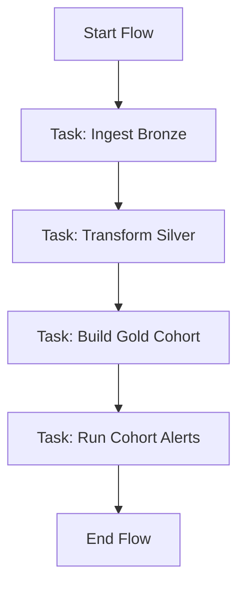

# Technical Design Document — CR-001: Medallion DuckDB Prefect Pipeline

This document specifies the technical design, schemas, performance optimization strategies, data quality containment logic, and Prefect orchestration for the Medallion database pipeline.

---

## 📐 Mathematical Formulation of Metrics

Let $u$ represent a user, and $T_{obs}$ represent the observation (cut-off) date.

### 1. Monthly Volume ($V_u(T_{obs})$)
The volume is the total loan amount disbursed to user $u$ in the 30-day window ending on the observation date, sourced from `silver.loans`:
$$V_u(T_{obs}) = \sum_{l \in L_u} \text{amount}(l) \times \mathbb{I}\left( T_{obs} - 30 \le \text{disbursement\_date}(l) \le T_{obs} \right)$$
Where:
- $L_u$ is the set of all loans in `silver.loans` belonging to user $u$.
- $\mathbb{I}(\cdot)$ is the indicator function.

### 2. Session Regularity ($R_u(T_{obs})$)
Session regularity is the count of distinct calendar days in UTC where user $u$ has at least one logged session in the 30-day window ending on the observation date, sourced from `silver.user_sessions`:
$$R_u(T_{obs}) = \left| \{ \text{date}(s) \mid s \in S_u \land T_{obs} - 30 \le \text{date}(s) \le T_{obs} \} \right|$$
Where:
- $S_u$ is the set of all sessions logged for user $u$ in `silver.user_sessions`.
- $\text{date}(s)$ extracts the calendar date from the session timestamp.

### 3. Target Default Indicator ($Y_u(T_{obs})$)
The binary target variable indicates whether the user defaults (exceeds 30 Days Past Due) on any payment due within the 12-month performance window following the observation date, sourced from `silver.loan_payments`:
$$Y_u(T_{obs}) = \max_{p \in P_u(T_{obs})} \mathbb{I}\left( \text{DPD}(p) > 30 \right)$$
Where:
- $P_u(T_{obs})$ is the set of all payment installments associated with user $u$'s loans in `silver.loan_payments` with a due date in the interval $(T_{obs}, T_{obs} + 12\text{ months}]$.
- The Days Past Due ($\text{DPD}$) for a payment installment $p$ is calculated as:
  $$\text{DPD}(p) = \begin{cases} 
      \text{payment\_date}(p) - \text{due\_date}(p) & \text{if payment\_date}(p) \text{ is not NULL} \\
      T_{current} - \text{due\_date}(p) & \text{if payment\_date}(p) \text{ is NULL} \text{ and } T_{current} > \text{due\_date}(p) \\
      0 & \text{otherwise}
  \end{cases}$$
  Here, $T_{current}$ represents the date the evaluation is performed.

---

## 🗄️ Database Schemas & Data Model

We utilize DuckDB schemas to separate the stages of the Medallion architecture: `bronze`, `silver`, and `gold`.

### 1. Bronze Layer (Raw Ingestion)
The Bronze layer stores the raw data as ingested, preserving duplicates and nulls. Column types are kept as `VARCHAR`/`TEXT` to avoid ingestion load failures.

#### Tables:
- **`bronze.users`**: `user_id` TEXT, `created_at` TEXT, `country` TEXT, `updated_at` TEXT, `ingestion_timestamp` TEXT
- **`bronze.user_sessions`**: `session_id` TEXT, `user_id` TEXT, `session_timestamp` TEXT
- **`bronze.loans`**: `loan_id` TEXT, `user_id` TEXT, `disbursement_date` TEXT, `amount` TEXT, `term_months` TEXT, `updated_at` TEXT, `ingestion_timestamp` TEXT
- **`bronze.loan_payments`**: `payment_id` TEXT, `loan_id` TEXT, `due_date` TEXT, `payment_date` TEXT, `amount_due` TEXT, `amount_paid` TEXT, `updated_at` TEXT, `ingestion_timestamp` TEXT

### 2. Silver Layer (Cleaned, Deduplicated, Typed)
The Silver layer cleans, converts, and deduplicates the Bronze data.

#### Tables:
- **`silver.users`**:
  * `user_id` VARCHAR PRIMARY KEY
  * `created_at` TIMESTAMP
  * `country` VARCHAR
  * `updated_at` TIMESTAMP
  * `ingestion_timestamp` TIMESTAMP
- **`silver.user_sessions`**:
  * `session_id` VARCHAR PRIMARY KEY
  * `user_id` VARCHAR
  * `session_timestamp` TIMESTAMP
- **`silver.loans`**:
  * `loan_id` VARCHAR PRIMARY KEY
  * `user_id` VARCHAR
  * `disbursement_date` DATE
  * `amount` DOUBLE
  * `term_months` INTEGER
  * `updated_at` TIMESTAMP
  * `ingestion_timestamp` TIMESTAMP
- **`silver.loan_payments`**:
  * `payment_id` VARCHAR PRIMARY KEY
  * `loan_id` VARCHAR
  * `due_date` DATE
  * `payment_date` DATE (NULLABLE)
  * `amount_due` DOUBLE
  * `amount_paid` DOUBLE
  * `updated_at` TIMESTAMP
  * `ingestion_timestamp` TIMESTAMP

### 3. Gold Layer (Business Aggregations)
The Gold layer contains the cohort features and targets computed from the Silver tables.

#### Table:
- **`gold.target_construction`**:
  * `user_id` VARCHAR NOT NULL
  * `observation_date` DATE NOT NULL
  * `monthly_volume` DOUBLE NOT NULL
  * `session_regularity` INTEGER NOT NULL
  * `target_default_30d` INTEGER NOT NULL
  * PRIMARY KEY (`user_id`, `observation_date`)

---

## ⚡ HPC (High-Performance Computing) Strategies

DuckDB is chosen for its high-performance SQL analytical capabilities:
1. **Vectorized In-Memory Execution**: DuckDB executes analytical queries in vectorized pipelines, dramatically accelerating aggregates (`SUM`, `COUNT`, `AVG`).
2. **Columnar Storage Format**: Slices out columns not used in calculations, minimizing memory footprint and CPU cache misses.
3. **Database Constraints & Indices**: Primary Keys and unique indexes on target/silver tables ensure fast joins and prevent duplicate inserts.
4. **Acid Transactions**: Silver and Gold migrations execute inside transaction blocks (`BEGIN TRANSACTION ... COMMIT`) to ensure atomicity.

---

## 🛡️ AI Logical Anomaly Containment & Data Quality Rules

To safeguard downstream layers against malformed or duplicate upstream data:
1. **Deduplication Strategy (`A5`)**:
   Deduplicate records using `ROW_NUMBER() OVER (PARTITION BY pk ORDER BY updated_at DESC, ingestion_timestamp DESC)` to isolate the most recent version of each record.
2. **Date Normalization (`A6`)**:
   Standardize dates using DuckDB's `strptime` or `TRY_CAST`. For example, dates containing slashes or dashes are processed using `COALESCE(try_cast(col as DATE), strptime(col, '%Y/%m/%d'), strptime(col, '%d-%m-%Y'))` to prevent run-time errors.
3. **Null PK Exclusion (`A5`)**:
   Discard rows containing NULL values in key identifiers (`user_id`, `session_id`, `loan_id`, `payment_id`).
4. **Timezone Uniformity**:
   All timestamps are standard UTC.

---

## 🌀 Prefect Orchestration & Pipeline Architecture

### Flow and Task Definitions:
- **`medallion_pipeline_flow(observation_date: str, db_path: str)`**:
  The main flow coordinating the entire pipeline.
- **`ingest_to_bronze_task(db_path: str, raw_data_dir_or_dicts: dict)`**:
  Loads raw data into the Bronze schema.
- **`transform_to_silver_task(db_path: str)`**:
  Runs DuckDB SQL script to clean, parse, and deduplicate Bronze records into Silver.
- **`build_gold_features_task(db_path: str, observation_date: str)`**:
  Computes user behavior variables and default targets from Silver tables and merges them idempotently into the Gold table.
- **`run_alerts_task(db_path: str, observation_date: str)`**:
  Evaluates cohort defaults in the Gold table and outputs a diagnostic warnings log if the default rate exceeds 15%.

### Error Handling & Retries:
- Prefect task options specify `retries=3` and `retry_delay_seconds=10` to handle transient database locks or SQLite/DuckDB connection issues.
