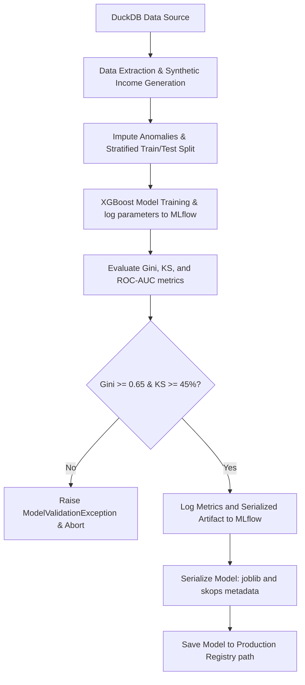

# Technical Design Document — CR-002: XGBoost Model Training Pipeline

This document specifies the technical design, mathematical formulations, training hyperparameters, data processing steps, validation thresholds, serialization methods, and MLflow tracking integration for the XGBoost credit risk model pipeline.

---

## 📐 Mathematical Formulation of Metrics

Let $y \in \{0, 1\}$ represent the true binary label (`target_default_30d`), where $y=1$ indicates default (positive class) and $y=0$ indicates non-default (negative class). Let $p(x) = P(y=1 \mid x)$ represent the model's predicted probability of default for feature vector $x$.

### 1. Area Under the ROC Curve (ROC-AUC)
Let $X_{def}$ represent the prediction scores for the default group ($y=1$) and $X_{non-def}$ represent the prediction scores for the non-default group ($y=0$). The ROC-AUC is mathematically formulated as:
$$\text{ROC-AUC} = P\left( p(x_i) > p(x_j) \mid y_i = 1, y_j = 0 \right)$$
Using the Wilcoxon-Mann-Whitney U-statistic:
$$\text{ROC-AUC} = \frac{\sum_{i:y_i=1} \sum_{j:y_j=0} \mathbb{I}\left( p(x_i) > p(x_j) \right) + \frac{1}{2}\mathbb{I}\left( p(x_i) = p(x_j) \right)}{N_{def} \times N_{non-def}}$$
Where:
- $N_{def}$ is the count of default users.
- $N_{non-def}$ is the count of non-default users.
- $\mathbb{I}(\cdot)$ is the indicator function.

### 2. Gini Index ($G$)
The Gini index (or Gini coefficient) measures the model's discriminative power and is directly calculated from the ROC-AUC:
$$G = 2 \times \text{ROC-AUC} - 1$$
Acceptance criterion: $G \ge 0.65$.

### 3. Kolmogorov-Smirnov (KS) Statistic
The KS statistic evaluates the maximum vertical distance between the empirical cumulative distribution functions (ECDF) of the default and non-default classes over the prediction threshold spectrum $t \in [0, 1]$:
$$F_{def}(t) = \frac{1}{N_{def}} \sum_{i:y_i=1} \mathbb{I}\left( p(x_i) \le t \right)$$
$$F_{non-def}(t) = \frac{1}{N_{non-def}} \sum_{j:y_j=0} \mathbb{I}\left( p(x_j) \le t \right)$$
$$KS = \max_{t} \left| F_{non-def}(t) - F_{def}(t) \right|$$
Acceptance criterion: $KS \ge 45\%$.

---

## 🛠️ Model Architecture & Hyperparameters

The core model is an Extreme Gradient Boosting classifier (`xgboost.XGBClassifier`). To prevent overfitting and ensure robust credit scoring, we establish the following base training hyperparameters:

| Parameter | Type | Default Value | Purpose |
| :--- | :--- | :--- | :--- |
| `n_estimators` | Integer | 100 | Number of gradient boosted trees. |
| `max_depth` | Integer | 5 | Maximum tree depth for base learners. |
| `learning_rate` | Float | 0.05 | Boosting learning rate (eta) to scale step sizes. |
| `subsample` | Float | 0.8 | Subsample ratio of the training instances. |
| `colsample_bytree` | Float | 0.8 | Subsample ratio of columns when constructing each tree. |
| `scale_pos_weight` | Float | *Dynamic* | Handles class imbalance. Calculated as $\frac{N_{non-def}}{N_{def}}$ from training split. |
| `objective` | String | `'binary:logistic'` | Standard logistic loss objective for probability output. |
| `eval_metric` | String | `'logloss'` | Evaluation metric for training validation. |
| `random_state` | Integer | 42 | Controls reproducibility of train/test splits and tree building. |

---

## 📊 Feature Engineering & Input Data

The pipeline consumes the following features:
1.  **`monthly_volume`** (Float, from `gold.target_construction`): Sum of loan amounts over the prior 30 days.
2.  **`session_regularity`** (Integer, from `gold.target_construction`): Count of unique days active in the last 30 days.
3.  **`income`** (Float): User monthly income.
    *   *Note*: As the current schemas do not contain an `income` column, the data preparation step must synthesize/impute `income` for each user based on a log-normal distribution correlating with `monthly_volume` (e.g. $income_u = \max(15000, 1.5 \times V_u(T_{obs}) + \epsilon)$ where $\epsilon \sim \mathcal{LN}(\mu=9.5, \sigma=0.5)$) or simulate it in tests to satisfy the acceptance criterion.

---

## 🛡️ AI Logical Anomaly Containment & Data Quality Rules

To guard against training model errors or contamination:
1.  **Feature Value Bound Containment**:
    *   If `monthly_volume` < 0, set to 0.
    *   If `session_regularity` < 0, set to 0; if `session_regularity` > 30, cap at 30.
    *   If `income` < 0 or NULL, impute with the training median.
2.  **Missing and Infinity Values (`A7`)**:
    *   Prior to training, any `NaN`, `None`, or infinite values in features are replaced with the feature's median value calculated strictly from the training set (to prevent data leakage).
3.  **Class Imbalance Handling**:
    *   Compute the ratio of non-defaults to defaults in the training split: `scale_pos_weight = count(non_default) / count(default)`. Pass this ratio dynamically to the model constructor.

---

## 🧪 Data Partitioning & Validation Pipeline

1.  **Data Split Strategy (`A3`)**:
    *   70% Train Split, 30% Test Split.
    *   The split must be **stratified** based on the target class (`target_default_30d`) to ensure that both training and testing datasets contain the same proportion of defaults.
2.  **Threshold Validation Gate (`A4`)**:
    *   Compute Gini index ($G$) and Kolmogorov-Smirnov statistic ($KS$) on the 30% Test Split.
    *   If $G < 0.65$ or $KS < 0.45$, raise `ModelValidationException` and abort the run.

---

## 🌀 MLflow Tracking & Serialization

### 1. MLflow Tracking Parameters & Metrics (`A6`)
- **Parameters**: `n_estimators`, `max_depth`, `learning_rate`, `subsample`, `colsample_bytree`, `scale_pos_weight`.
- **Metrics**: `gini_index`, `ks_statistic`, `roc_auc`, `accuracy`, `log_loss`.
- **Artifacts**: Serialized XGBoost model, feature list metadata, validation curves (optional).

### 2. Model Serialization & Verification (`A5`)
- The pipeline serializes the validated classifier model using `joblib` (e.g. `model.joblib`).
- The pipeline extracts the model's inputs and outputs signature and registers it using `skops.io.dump()` (e.g. `model.skops`) to prevent unsafe loading vulnerabilities in production.
